# Premier Can — Sistema de gestión para clínica veterinaria

Sistema web completo para administrar una clínica veterinaria: historias clínicas, vacunas, citas, recordatorios automáticos, inventario por lotes, compras a proveedores, caja con promociones y un **portal para los dueños de las mascotas** (también disponible como app Android).


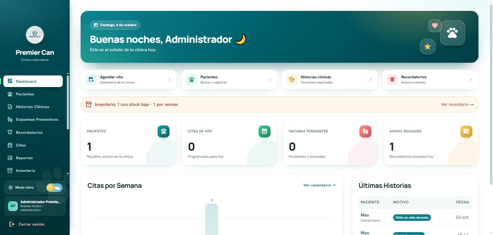

> Proyecto desarrollado para la clínica veterinaria **Premier Can** (Lima, Perú). El nombre se usa con autorización de la clínica. Todos los datos que aparecen en las capturas son ficticios.

---

## Índice

- [Qué resuelve](#qué-resuelve)
- [Funcionalidades](#funcionalidades)
- [Flujo del negocio](#flujo-del-negocio)
- [Tecnologías](#tecnologías)
- [Seguridad](#seguridad)
- [Estructura del proyecto](#estructura-del-proyecto)
- [Instalación](#instalación)
- [Probar el sistema](#probar-el-sistema-usuarios-de-demostración)
- [Capturas](#capturas)
- [Autor](#autor)

## Qué resuelve

| Antes | Con el sistema |
|---|---|
| Historias clínicas en papel | Historia clínica digital con peso, diagnóstico, receta y archivos |
| Citas cruzadas u olvidadas | Agenda por veterinario y horario, y recordatorios automáticos por correo y app |
| Vacunas atrasadas | Esquema preventivo con próximas dosis y carnet con código QR |
| Medicamentos agotados o vencidos | Inventario por lote y vencimiento (FEFO), pedido sugerido y solicitudes del personal |
| Cobros sin control | Punto de venta ligado a la historia clínica, con promociones, descuentos con motivo y cierre de caja |
| Compras sin registro | Proveedores verificados en SUNAT, facturas, lotes y cuentas por pagar |

## Funcionalidades

### Panel de la clínica (personal)

- **Pacientes y propietarios:** registro con validación de DNI y correo, foto (archivo o cámara) y acceso al portal para el dueño.
- **Historias clínicas:** consultas con peso, temperatura, diagnóstico, tratamiento y receta (imprimible o PDF); gráfico de evolución del peso; análisis y radiografías como archivos privados.
- **Esquemas preventivos:** vacunas y desparasitaciones, próximas dosis, estado (al día / pendiente / atrasado) y **carnet de vacunación con QR**.
- **Citas:** calendario semanal, tipos de cita con duración, horario de cada veterinario, asistencia y atención directa desde la cita.
- **Recordatorios automáticos:** cada 15 minutos genera y envía por **correo** y **notificación en la app** los avisos de citas (10 días, 3 días, 1 día y 5 horas antes) y de próximas dosis; también admite avisos manuales y masivos.
- **Inventario:** stock **por lote y vencimiento**, salidas FEFO (sale primero lo que vence antes), conteos, bajas, registro SENASA, cadena de frío, costo, margen y valor del inventario.
- **Compras y proveedores:** proveedores con **RUC verificado en SUNAT** (consulta automática), compras con factura, boleta o guía, ingreso por lotes, **cuentas por pagar**, **pedido sugerido** automático (stock mínimo y solicitudes del personal) y envío del pedido por WhatsApp.
- **Caja:** cobro de las consultas pendientes con sus medicamentos recetados, servicios con tarifa, productos del inventario, **promociones automáticas por categoría**, **descuento por producto** o general (con motivo y límite por rol), ticket, anulaciones y **cierre de caja** con cuadre de efectivo.
- **Promociones:** publicación con imagen, vigencia y descuento automático en caja; el cliente las ve en el portal y recibe una notificación.
- **Reportes:** actividad del periodo, cobertura de vacunación, asistencia a citas, motivos frecuentes, ingresos por método de pago y **satisfacción de clientes**.
- **Administración:** personal, usuarios con rol y horario, y **registro de actividad (auditoría)** de todas las acciones.
- **Modo claro y oscuro** en todo el sistema.

### Portal de clientes (web y app Android)

- Registrar a sus mascotas (con foto) y ver su ficha: historial médico, recetas, vacunas, peso y análisis.
- Agendar citas solo en horarios válidos, confirmar asistencia o cancelar.
- Calificar la atención con estrellas y comentario.
- Avisos de la clínica, promociones y carnet de vacunación en PDF.

## Flujo del negocio

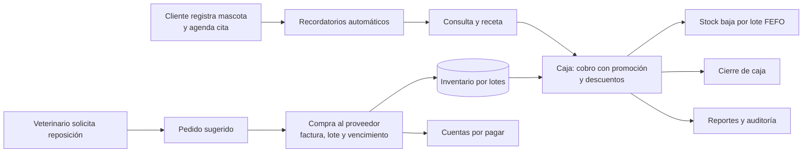

Cada paso del flujo se validó de punta a punta con datos de prueba: desde la solicitud de reposición hasta el cierre de caja y el pago al proveedor.

## Tecnologías

| Capa | Tecnología |
|---|---|
| Backend | Node.js, Express (API REST) |
| Base de datos | Microsoft SQL Server 2022 (transacciones, índices filtrados, auditoría) |
| Frontend | HTML, JavaScript y Tailwind CSS, adaptable al celular, con modo oscuro |
| App móvil | Capacitor 8 (Android) con tareas en segundo plano para las notificaciones |
| Autenticación | JWT, bcrypt y verificación en dos pasos (TOTP) |
| Correo | Nodemailer (Gmail) o Mailgun |
| Integraciones | Consulta de RUC en el padrón de SUNAT (apis.net.pe), validación de DNI (RENIEC), WhatsApp |
| Publicación | ngrok (dirección pública fija) |

## Seguridad

- Contraseñas cifradas con bcrypt y **verificación en dos pasos** para el personal administrativo.
- Bloqueo temporal tras varios intentos fallidos de inicio de sesión.
- Sesiones que vencen; una cuenta desactivada o con contraseña cambiada se expulsa al instante.
- **Control por rol en el servidor:** el veterinario no ve compras ni costos, y el cliente solo accede a sus propias mascotas.
- Encabezados de seguridad (Helmet y CSP), escape de todo el texto mostrado y validación real del tipo de cada archivo subido.
- Archivos clínicos privados, que no son accesibles por enlace público.
- Registro de auditoría y respaldos verificados de la base de datos.
- Ningún secreto está en el código: todo se configura en `backend/.env` (ver `.env.example`).

## Estructura del proyecto

```
├── backend/
│   ├── server.js              # Servidor Express
│   ├── config/                # Conexión a SQL Server
│   ├── controllers/           # Lógica de cada módulo (caja, compras, citas…)
│   ├── routes/                # Rutas de la API
│   ├── middleware/            # Autenticación, roles y límites de intentos
│   ├── utils/                 # Lotes FEFO, precios, RUC/SUNAT, correo, auditoría…
│   ├── scripts/               # Crear la base de datos, respaldos, carga de proveedores
│   ├── public/                # Panel (pages/), portal de clientes (cliente/) y recursos
│   └── .env.example           # Plantilla de configuración
├── premiercan-app-clientes/   # App Android (Capacitor)
├── premier_can_database.sql   # Esquema base
├── migracion_*.sql            # Migraciones (se aplican en orden con crear-bd.js)
├── iniciar-premiercan.bat     # Enciende SQL Server, el servidor y el túnel
├── detener-premiercan.bat     # Respalda y apaga todo
└── docs/capturas/             # Imágenes de este README
```

## Instalación

### Requisitos

- Windows 10 u 11
- [Node.js](https://nodejs.org/) 20 o superior
- [SQL Server 2022 Express](https://www.microsoft.com/es-es/sql-server/sql-server-downloads) con autenticación mixta
- Opcional: [ngrok](https://ngrok.com/) para publicar el sistema en internet

### Pasos

1. **Clonar el repositorio**
   ```bash
   git clone https://github.com/sandher-soriano/sistema-clinica-veterinaria.git
   cd sistema-clinica-veterinaria/backend
   npm install
   ```

2. **Configurar el entorno:** copia `backend/.env.example` como `backend/.env` y completa los valores: usuario y contraseña de la base de datos, `JWT_SECRET` (texto aleatorio largo), correo y, si los usas, el dominio de ngrok y los tokens de RENIEC o SUNAT.

3. **Crear la base de datos.** Guarda la contraseña del usuario `sa` de SQL Server en `%LOCALAPPDATA%\PremierCan\sa.txt` (fuera del proyecto) y ejecuta:
   ```bash
   node scripts/crear-bd.js
   ```
   El script crea la base, aplica todas las migraciones y crea el usuario de la aplicación. Se puede volver a ejecutar sin perder datos.

4. **(Opcional) Cargar proveedores reales verificados en SUNAT:**
   ```bash
   node scripts/cargar-proveedores-peru.js
   ```

5. **Iniciar el servidor**
   ```bash
   npm start
   ```
   Abre `http://localhost:4000` para el panel y `http://localhost:4000/cliente/login.html` para el portal de clientes. En Windows también puedes usar `iniciar-premiercan.bat` y `detener-premiercan.bat`.

### Probar el sistema (usuarios de demostración)

Al terminar la instalación, el script `crear-bd.js` deja creados estos usuarios para probar cada rol:

| Rol | Dónde entrar | Usuario | Contraseña |
|---|---|---|---|
| Administrativo | `http://localhost:4000` → pestaña **Administrativo** | `admin` | `123456` |
| Veterinario | `http://localhost:4000` → pestaña **Veterinario** | `vet.demo` | `123456` |
| Cliente | `http://localhost:4000/cliente/login.html` | Se crea desde el panel (ver abajo) | Temporal, la elige el sistema |

- **Administrativo:** en el primer ingreso el sistema muestra un **código QR**. Escanéalo con una app autenticadora (Google Authenticator, Microsoft Authenticator, Authy…) y escribe el código de 6 dígitos. Desde entonces, cada ingreso pide ese código.
- **Cliente:** entra como administrativo o veterinario, registra una mascota en **Pacientes** con el correo del dueño y pulsa 🔑 **Dar acceso al portal**. El dueño recibe una contraseña temporal y la cambia en su primer ingreso.
- Para cargar proveedores de ejemplo: `node scripts/cargar-proveedores-peru.js`.

> ⚠️ Estas credenciales son **solo para una instalación local de prueba**. Antes de usar el sistema con datos reales, cambia las contraseñas de `admin` y `vet.demo` (o crea usuarios nuevos y desactiva los de demostración).

### App Android

1. En `premiercan-app-clientes/`, copia `capacitor.config.example.json` como `capacitor.config.json`, y `www/runners/promociones.example.js` como `www/runners/promociones.js`.
2. En ambos archivos reemplaza `TU-DOMINIO` por la dirección pública del sistema.
3. Ejecuta `npm install` y `npx cap sync android`, y compila con Android Studio.

## Capturas

| | |
|---|---|
| 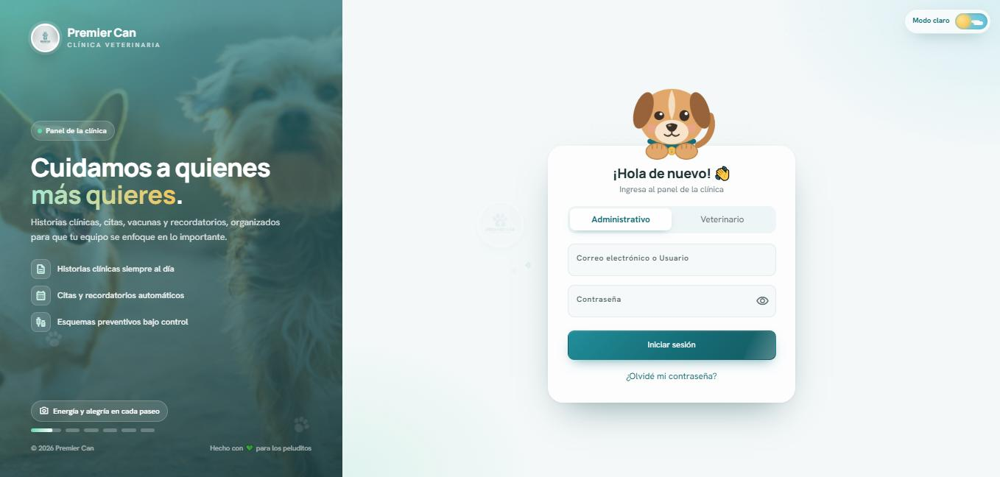 **Inicio de sesión** | 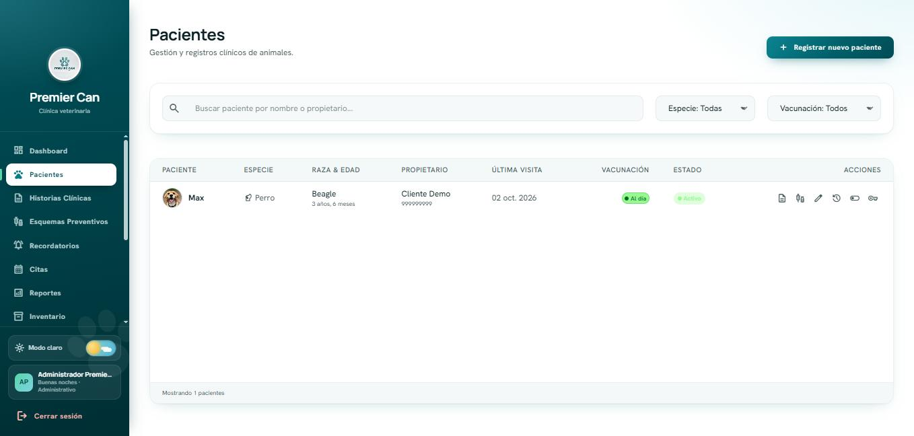 **Pacientes** |
| 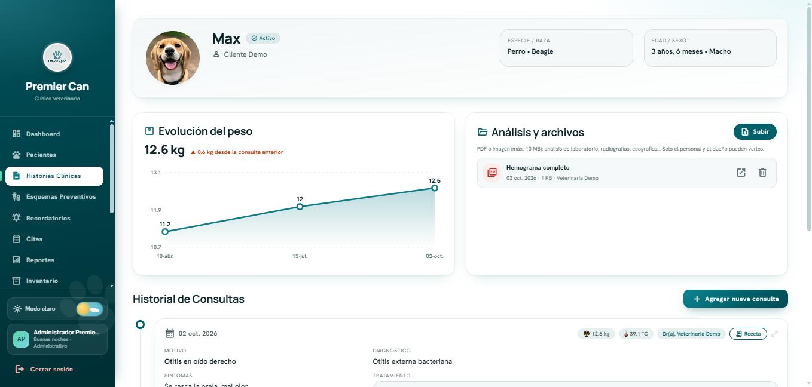 **Historia clínica y peso** | 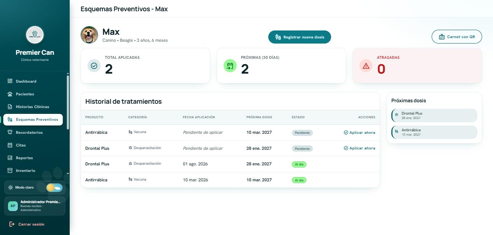 **Esquema de vacunas** |
| 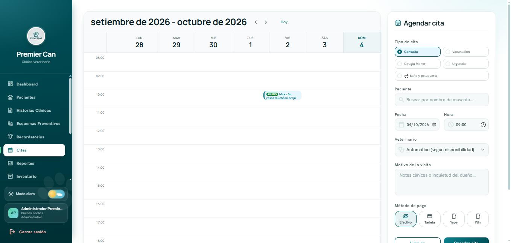 **Agenda de citas** | 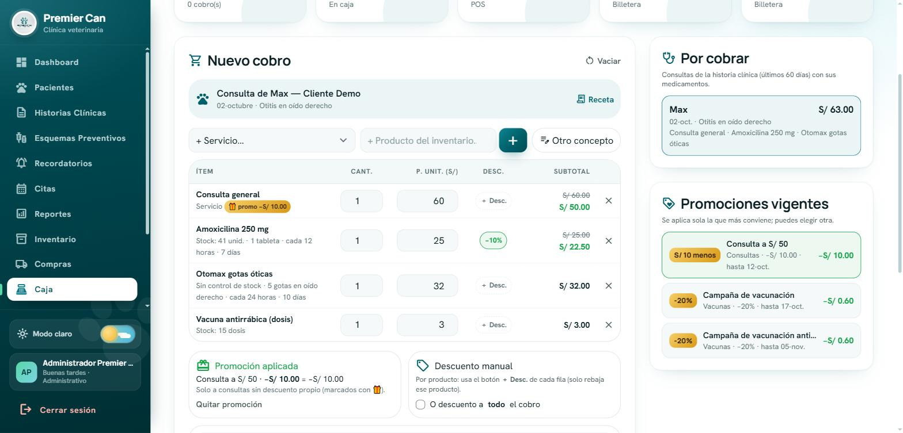 **Caja con promociones y descuento por producto** |
| 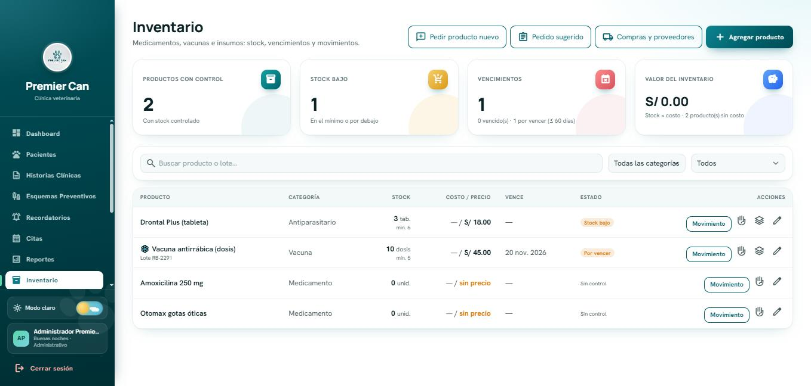 **Inventario por lotes** | 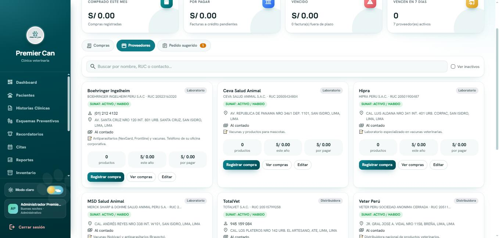 **Proveedores verificados en SUNAT** |
| 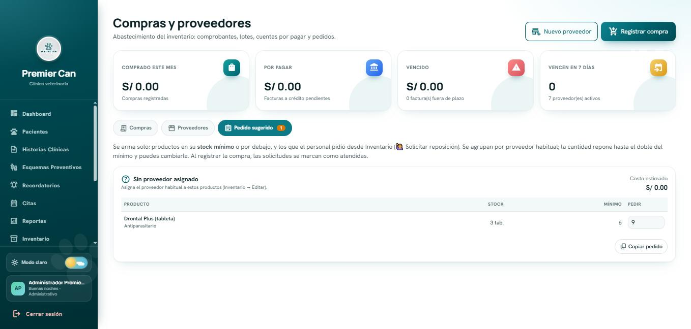 **Pedido sugerido** | 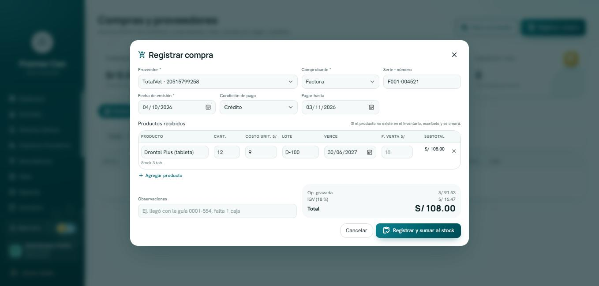 **Compra con factura a crédito** |
| 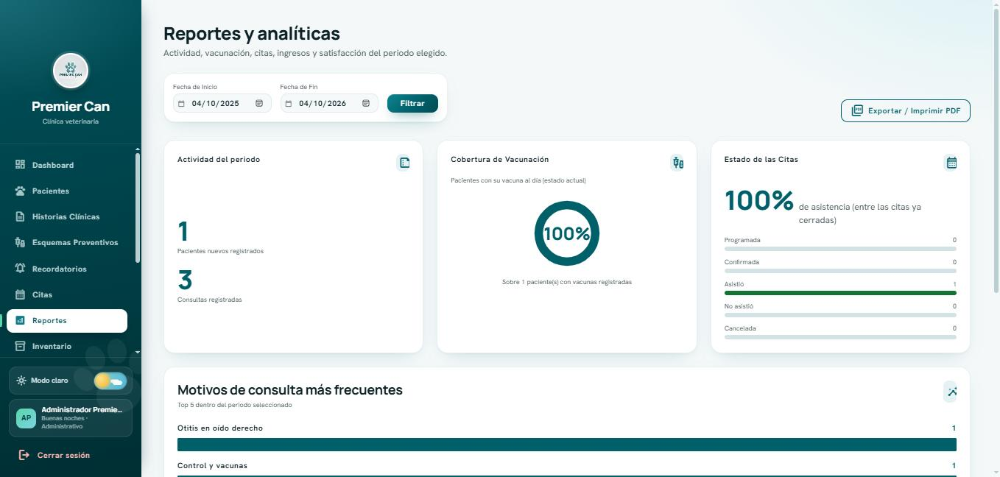 **Reportes** | 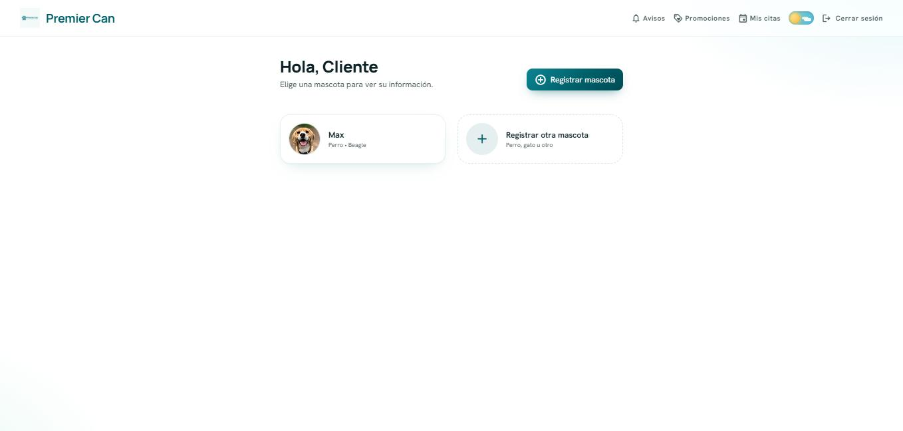 **Portal de clientes** |
| 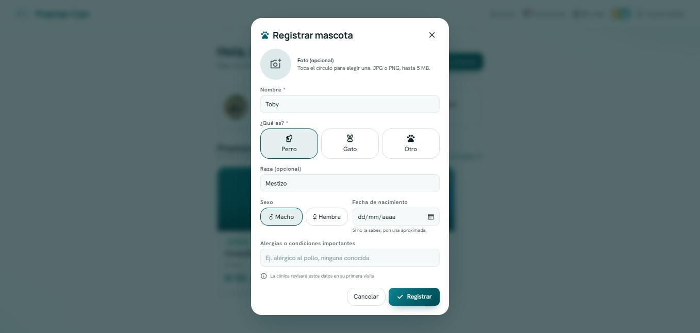 **El cliente registra su mascota** | 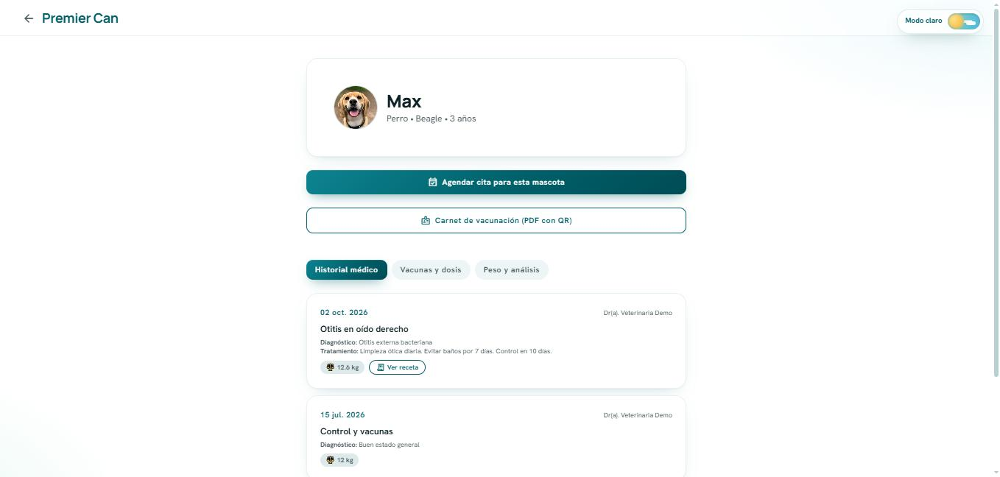 **Ficha de la mascota** |
| 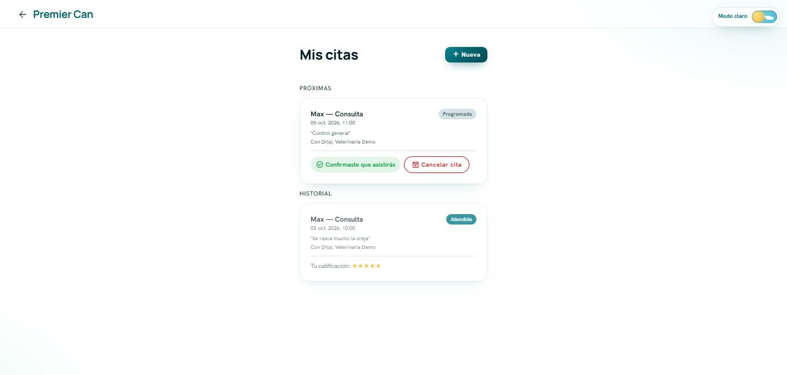 **Mis citas y calificación** | |

## Autor

**Sandher Soriano** — [github.com/sandher-soriano](https://github.com/sandher-soriano)

Proyecto de portafolio. © 2026. Todos los derechos reservados.
